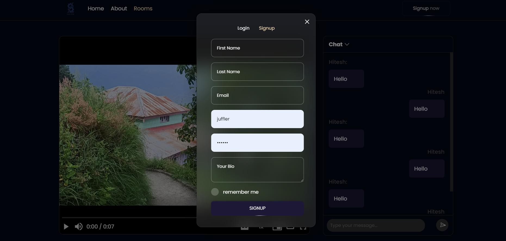

# PrimeArchive: Chat Room Media Player

Welcome to PrimeArchive, an innovative web application that combines the functionality of a chat room with media playback capabilities. PrimeArchive allows users to create and join chat rooms where they can watch or listen to media together while engaging in real-time chat. This project aims to provide a seamless and interactive experience for users to enjoy media content in a social setting.
##ScreenShots:
1. 
---
2. 
---
3. 
---
4. 
---
5. 
---
6. 

## Overview

PrimeArchive offers a platform for users to create and host chat rooms, whether for private gatherings or public events. Participants can join these rooms to watch videos, listen to music, or engage in any other media playback, while simultaneously communicating through live chat. The project utilizes micro-services architecture to ensure scalability and efficiency.

## Key Features

- **Room Creation**: Users can create both private and public chat rooms.
- **Media Playback**: Hosts can play any media content within the room, including videos, audio tracks, or live streams.
- **Real-time Chat**: Participants can chat with each other in real-time while watching or listening to media.
- **Media Control Requests**: Participants can request the host to make changes to the media playback, such as pausing, skipping, or adjusting the volume.
- **User Authentication**: The application provides secure login and signup features for user authentication, ensuring privacy and data protection.
- **Responsive Design**: The user interface is designed to be responsive, providing an optimal viewing and chatting experience across various devices.

## Technology Stack

- **Frontend**: Built using 11ty static site generator with Nunchucks template engine for dynamic content rendering.
- **Backend**: Micro-services architecture for scalability and flexibility.
- **Authentication**: Custom authentication API integrated with the backend for secure user authentication.
- **Media Player**: Utilizes HTML5 media elements and custom JavaScript for media playback control.
- **Styling**: Custom CSS for a unique and visually appealing user interface.

## Project Status

PrimeArchive is currently under active development, with login/signup features and media player functionality fully implemented. The backend authentication API is successfully integrated, and the chat feature is also operational. Further enhancements and features are planned for future releases.

## Setup Instructions

To set up PrimeArchive locally, follow these steps:

1. Clone the repository to your local machine.
2. Install dependencies using npm or yarn.
3. Run the development server.
4. Access the application in your web browser.
5. Sign up or log in to create or join chat rooms and start enjoying media playback with real-time chat.

## License

This project is not open-source but this version is to showcase the main idea and basic first version of prototype.
